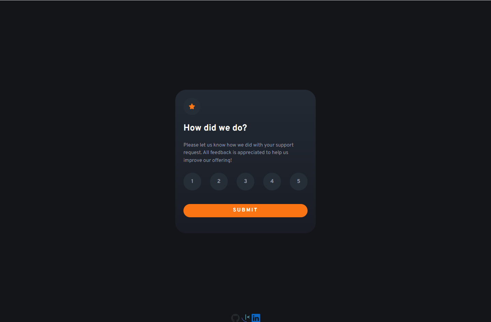
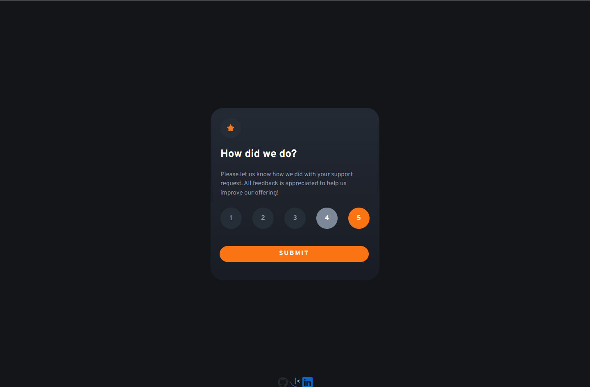
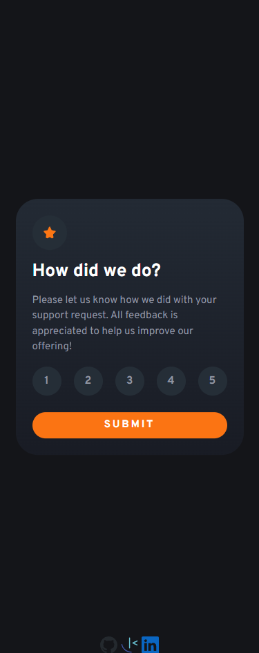
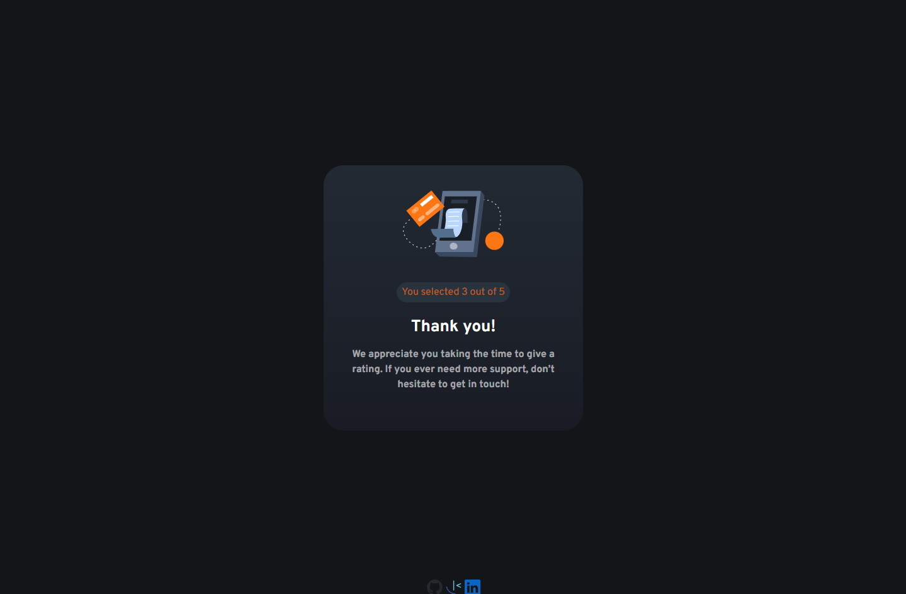
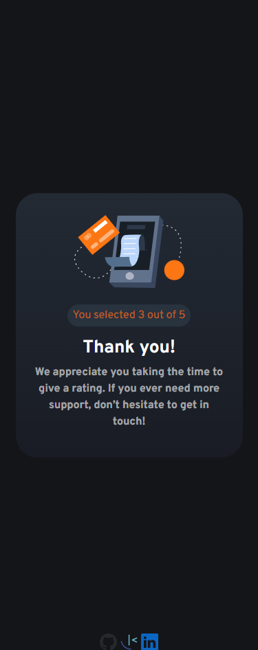

- Solution URL: [Add solution URL here](https://your-solution-url.com)
- Live Site URL: [Add live site URL here](https://your-live-site-url.com)

# Frontend Mentor - Interactive rating component solution

This is a solution to the [Interactive rating component challenge on Frontend Mentor](https://www.frontendmentor.io/challenges/interactive-rating-component-koxpeBUmI). Frontend Mentor challenges help you improve your coding skills by building realistic projects. 

## Table of contents

- [Overview](#overview)
  - [The challenge](#the-challenge)
  - [Screenshot](#screenshot)
- [My process](#my-process)
  - [Built with](#built-with)
  - [What I learned](#what-i-learned)
  - [Continued development](#continued-development)
  - [Useful resources](#useful-resources)
- [Author](#author)

## Overview

### The challenge

Users should be able to:

- View the optimal layout for the app depending on their device's screen size
- See hover states for all interactive elements on the page
- Select and submit a number rating
- See the "Thank you" card state after submitting a rating

### Screenshot

## My process

- npm install --save-dev sass
- npm install bootstrap
- npm run dev
- Open [http://localhost:3000](http://localhost:3000). You can start editing the page by modifying `pages/index.js`. The page auto-updates as you edit the file.
- Firstly import bootstrap bundled scss and js in pages/_app.js
- Found an issue with importing bootstrap js files and found the fix to use the useEffect hook to require the bootstrap js files in _app.js. ["https://blog.logrocket.com/handling-bootstrap-integration-next-js/"]. This error is due to the document object not being available untill the page loads due to next.js server side rendering by default feature.
- Change globals to scss file in and update pages/_app.js import
- Add sass partials for rating, thankyou and main.
- import partials into globals. use rules go first!
- When importing a google font make sure to add to the end '&display:swap'. So the browser displays a font whilst this font is being loaded!
- Create components/index/ and add all components needed!
- Dont need home.module.css as we are not using modules in this project.
- Need a state in main component to be able to change to the thankyou component! This is passed down with props so child components can change the value to re-render the main - component and change to the thankyou component! We also need a state variable for the selectdRating that gets passed from the rating component to the main component!
rating component doesnt need to rerender so we use a normal variable here.
- From here we can just style our components using the partials we have setup!
- I try to prioritize using bootstrap classes first though.
- To get the responsiveness i use bootstrap breakpoints and media queries at the same breakpoints in my partials!
- Use of display:swap in google font to ensure lighthouse likes the webpage!

### Built with

- Semantic HTML5 markup
- CSS custom properties
- Sass
- Flexbox
- Bootstrap
- React.jsx / Next.js
- Mobile-first workflow
- [React](https://reactjs.org/) - JS library
- [Next.js](https://nextjs.org/) - React framework

### What I learned

- How to incorporate bootstrap into a next.js project.
- Reinstated some react core principals like props, state, hooks and components/components nesting.
- Using css custom properties to easily make hsl values in which you can change the alpha value.

### Continued development

- Definitely want to progress with more next.js projects and learn react more!
- Display:swap in google fonts to make lighthouse happy!
- Always checking pages with lighthouse, w3c html validator and the accessebility insights for web extension.
Use this section to outline areas that you want to continue focusing on in future projects. These could be concepts you're still not completely comfortable with or techniques you found useful that you want to refine and perfect.

### Useful resources

- ["https://blog.logrocket.com/handling-bootstrap-integration-next-js/"] - Importing bootstrap in next.js requires a different method!
- [API routes](https://nextjs.org/docs/api-routes/introduction) can be accessed on [http://localhost:3000/api/hello](http://localhost:3000/api/hello). This endpoint can be edited in `pages/api/hello.js`.
- [Next.js Documentation](https://nextjs.org/docs) - learn about Next.js features and API.
- [Learn Next.js](https://nextjs.org/learn) - an interactive Next.js tutorial.
- [Next.js deployment documentation](https://nextjs.org/docs/deployment) - Deployment details.
- [Vercel Platform](https://vercel.com/new?utm_medium=default-template&filter=next.js&utm_source=create-next-app&utm_campaign=create-next-app-readme) - The easiest way to deploy your Next.js app.
- [API routes](https://nextjs.org/docs/api-routes/introduction) The `pages/api` directory is mapped to `/api/*`. Files in this directory are treated asinstead of React pages.
- This project uses [`next/font`](https://nextjs.org/docs/basic-features/font-optimization) to automatically optimize and load Inter, a custom Google Font.

## Author

- GitHub - ["https://github.com/MoggStephen"]
- Frontend Mentor - [@moggstephen](https://www.frontendmentor.io/profile/MoggStephen)
- Linkedin - [@moggstephen]("https://www.linkedin.com/in/stephen-mogg-9467041bb/")